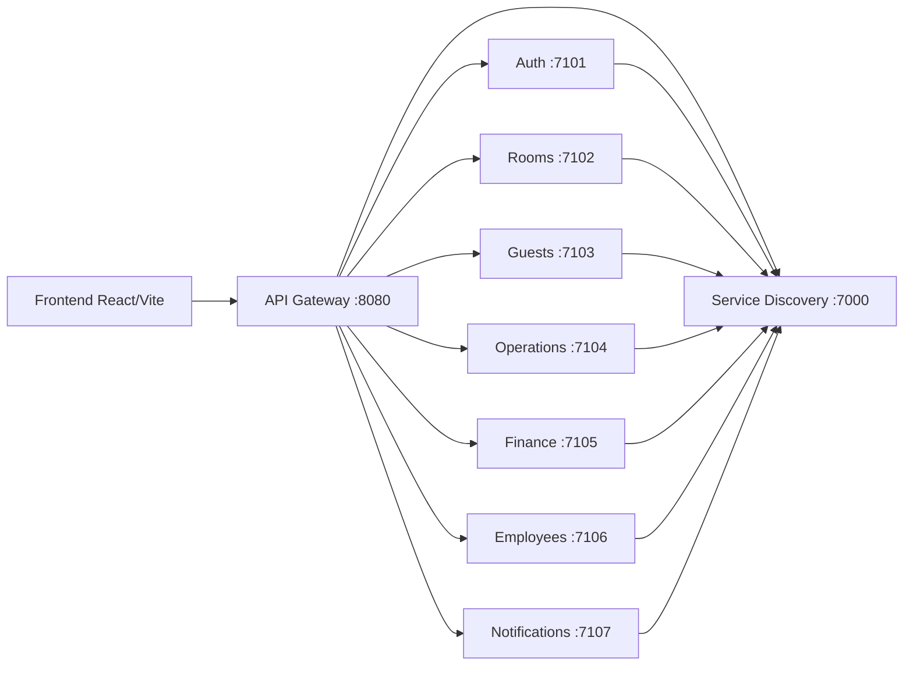

# Arquitectura SIMOT v2.0

## Separacion de responsabilidades

El backend esta dividido por dominio, no por pantalla:

- Auth: credenciales, sesiones y perfiles de acceso.
- Rooms: inventario de habitaciones, estados, limpieza y disponibilidad.
- Guests: huespedes, pagos, check-in y check-out.
- Operations: agenda diaria, bitacora, alertas y checklist de turno.
- Finance: caja por turnos, movimientos, ingresos, gastos y reportes.
- Employees: empleados, turnos y permisos operativos.
- Notifications: comprobantes por correo y registro local de envios.

## Componentes de microservicios

## Despliegue independiente

El repositorio soporta dos modos:

- **Modo demo cloud**: `npm start` levanta todos los servicios en un unico Web Service de Render. Sirve para cuentas gratis, pruebas rapidas y defensa funcional.
- **Modo microservicios real**: cada servicio se despliega como Web Service propio usando `npm run start:<servicio>`. En este modo cada microservicio escala, reinicia y se publica de forma independiente.

Scripts disponibles:

| Servicio | Script | Responsabilidad | Puerto interno |
| --- | --- | --- | --- |
| Discovery | `npm run start:discovery` | Registro y salud de servicios | `DISCOVERY_PORT` |
| Gateway | `npm run start:gateway` | Unico punto de entrada del frontend | `PORT`/`GATEWAY_PORT` |
| Auth | `npm run start:auth` | Usuarios, roles, sesiones y permisos | `AUTH_PORT` |
| Rooms | `npm run start:rooms` | Habitaciones, estados, tarifas y notas | `ROOMS_PORT` |
| Guests | `npm run start:guests` | Huespedes, pagos, check-in/check-out | `GUESTS_PORT` |
| Operations | `npm run start:operations` | Bitacora, agenda y checklist | `OPERATIONS_PORT` |
| Finance | `npm run start:finance` | Caja, movimientos, reportes Excel | `FINANCE_PORT` |
| Employees | `npm run start:employees` | Empleados, turnos y modulos asignados | `EMPLOYEES_PORT` |
| Notifications | `npm run start:notifications` | Comprobantes, bienvenida y pruebas SMTP | `NOTIFICATIONS_PORT` |

En despliegue independiente cada servicio debe tener:

- `DISCOVERY_URL`: URL publica del servicio descubridor.
- `SERVICE_URL`: URL publica del propio servicio para registrarse.
- Variables de Supabase si guarda estado.
- Variables SMTP solo en Notifications.

El archivo `render.microservices.yaml` deja un blueprint de referencia para separar los servicios en Render.

## Discovery y Gateway

Discovery mantiene un heartbeat por servicio. Si el heartbeat vence, el servicio aparece como `stale` y el gateway no debe enrutar trafico a ese upstream.

El API Gateway:

- Resuelve servicios dinamicamente via Discovery.
- Cachea resoluciones brevemente para bajar latencia.
- Reenvia headers de autorizacion.
- Propaga archivos como Excel usando `content-disposition`.
- Tiene timeout de upstream con `UPSTREAM_TIMEOUT_MS`.
- Devuelve errores por servicio para depurar sin tumbar el frontend.

## Flujo principal

1. Cada microservicio levanta en su propio puerto.
2. Cada microservicio se registra en `discovery` con nombre y URL.
3. El frontend llama solo al `api-gateway`.
4. El gateway resuelve el servicio en discovery y reenvia la peticion.
5. Notifications prepara comprobantes por correo; si no hay SMTP, queda registrado en modo local.

## Cronograma aplicado

El Gantt entregado cubre analisis, infraestructura, desarrollo core, modulo contable, pruebas y entrega. Esta base local deja implementadas las actividades necesarias hasta la fecha actual del entorno, 2026-07-07:

- Analisis y diseno: modulos definidos desde el PDF y capturas.
- Infraestructura: monorepo, scripts, gateway, discovery y servicios independientes.
- Desarrollo core: auth, dashboard, habitaciones, huespedes, limpieza, bitacora y checklist.
- Modulo contable: caja por turnos, movimientos, resumen financiero y comprobantes.
- Pruebas y entrega: smoke test, build frontend, auditoria npm y documentacion tecnica.

## Mejoras frente al informe original

- Backend desacoplado en microservicios, no una sola API.
- API Gateway como unico punto de entrada del frontend.
- Service Discovery para registro dinamico.
- Health checks y TTL de heartbeat para detectar servicios caidos.
- Scripts y blueprint para despliegue independiente por servicio.
- Servicio de notificaciones para comprobantes por correo.
- Auditoria de dependencias sin vulnerabilidades conocidas.
- Prueba de humo automatizada para login, habitaciones, huespedes y comprobantes.
